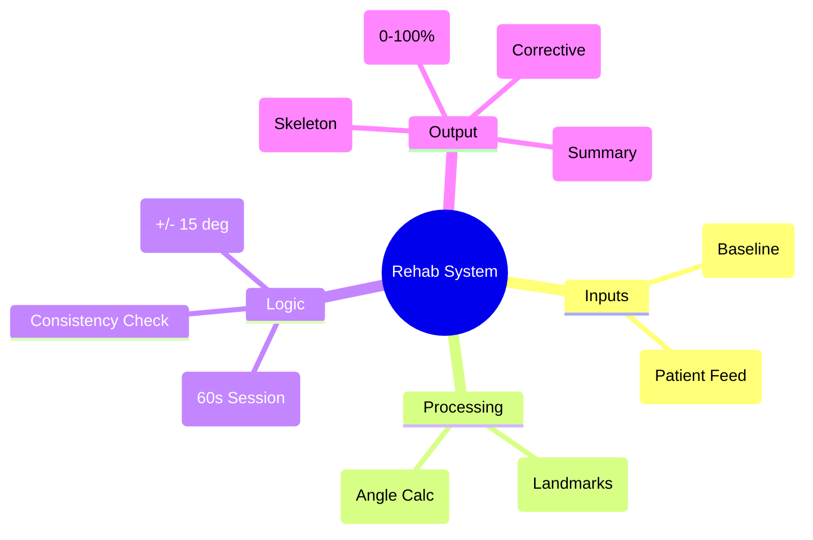

 ### AI-Based Rehabilitation Monitoring System

##  Problem Statement

Traditional pose evaluation systems often fail in rehabilitation contexts because they:
*   **Evaluate frame-by-frame**, penalizing momentary instability.
*   **Expect perfect stillness**, which is impossible for patients with motor impairments.
*   **Lack longitudinal context**, failing to track recovery trends over time.

This system addresses these gaps by evaluating **pose consistency over time**, allowing for natural postural sway and muscle fatigue while providing human-centric, corrective feedback.

##  System Overview

This is a **real-time AI rehabilitation posture evaluation system** built using **Python**, **OpenCV**, and **MediaPipe Pose**. 

Instead of simple classification, it treats "yoga postures" as **structured motion templates** for rehabilitation exercises. It compares live patient movement against a biomechanical baseline (reference pose) to assess joint stability, range of motion, and endurance.

### Key Technologies
*   **MediaPipe Pose**: High-fidelity, real-time body landmark tracking (33 keypoints).
*   **OpenCV**: Video processing and visual overlay rendering.
*   **Vector Geometry**: Calculation of 8 key biomechanical joint angles.

##  Mind Map



##  Flow Diagram

```text
START
  │
  ▼
[ Load Reference Pose ] ─── (Biomechanical Baseline)
  │
  ▼
[ Initialize Webcam ]
  │
  ▼
┌ < Loop: 60-Second Session > ──────────────────────────────┐
│                                                           │
│  1. Capture Frame                                         │
│  2. Extract 33 Landmarks (MediaPipe)                      │
│  3. Compute 8 Joint Angles (Vector Geometry)              │
│  4. Compare vs. Reference (Tolerance: ±15°)               │
│  5. Visual Feedback (Green/Red Skeleton Overlay)          │
│  6. Text Feedback (e.g., "Straighten Right Elbow")        │
│  7. Store Frame Data (Angles & Score)                     │
│                                                           │
└───────────────────────────┬───────────────────────────────┘
                            │
                            ▼
                  [ Session Complete ]
                            │
                            ▼
              [ Compute Average Consistency ]
              (Mean Score over 60s Duration)
                            │
                            ▼
              [ Generate Rehabilitation Report ]
              (Progress, Stability, Motivation)
                            │
                            ▼
                           END
```


##  Core Features

### 1. Biomechanical Angle Analysis
The system computes **8 key joint angles** using vector geometry:
1.  **Shoulder–Elbow–Wrist** (Left & Right)
2.  **Elbow–Shoulder–Hip** (Left & Right)
3.  **Shoulder–Hip–Knee** (Left & Right)
4.  **Hip–Knee–Ankle** (Left & Right)

### 2. Real-Time Visual Feedback
*   **Visual Overlays**: Incorrect joints are highlighted in red; correct ones in green.
*   **Text Guidance**: Specific instructions like "Extend right arm" or "Bend left knee".
*   **Live Score**: A dynamic percentage score reflecting current posture accuracy.

### 3. Session-Based Architecture
*   The system operates in **60-second evaluation sessions**.
*   It does not judge a single frame but averages performance over the entire minute.
*   This accounts for **postural sway** and **endurance**, which are critical rehab metrics.

##  Time-Based Evaluation Logic

**Why Time-Based?**
In rehabilitation, holding a pose is harder than hitting it once. Patients often tremble or sway.

*   **Duration**: 60 seconds per exercise.
*   **Scoring**: The final score is an average of all frame scores, smoothing out outliers caused by momentary loss of balance.
*   **Interpretation**:
    *   **≥ 60%**: Good performance (Stable)
    *   **40–60%**: Partial correctness (Improving)
    *   **< 40%**: Needs improvement (Focus on basics)

##  Rehabilitation Relevance

This system is designed with **"Progress over Perfection"** in mind.

*   **Tolerance**: It allows for a +/- 15 degree deviation from the ideal pose to accommodate limited range of motion.
*   **Motivation**: Feedback is constructive ("Try to extend..." rather than "Wrong").
*   **Holistic View**: By tracking the *entire* session, it identifies fatigue points (e.g., score dropping in the last 10 seconds).


## Outputs


##  Demo Instructions

To run the rehabilitation monitoring prototype:

1.  **Install Dependencies**:
    ```bash
    pip install -r requirements.txt
    ```

2.  **Run the Real-Time Evaluation**:
    ```bash
    python demo_opencv.py
    ```
    *   Ensure your webcam is connected.
    *   Stand back to let the camera see your full body.
    *   Follow the on-screen instructions to match the reference pose.

3.  **CLI Tools (Optional)**:
    For batch processing or advanced analysis:
    ```bash
    python -m src.main --help
    ```

##  Future Extensions

*   **Longitudinal Database**: Store patient session data to plot recovery curves over weeks.
*   **ROM Quantification**: Automatically measure and log max Range of Motion (ROM) for specific joints.
*   **Telerehab Dashboard**: A web interface for therapists to review patient sessions remotely.
*   **Voice Coaching**: Integrate TTS to speak corrections aloud for visually impaired patients.


##  Summary

The **AI-Based Rehabilitation Monitoring System** bridges the gap between rigid computer vision metrics and the fluid reality of physical therapy. By focusing on **consistency**, **time-based evaluation**, and **forgiving thresholds**, it provides a tool that is not just accurate, but **clinically relevant** and **encouraging** for patients on their road to recovery.


